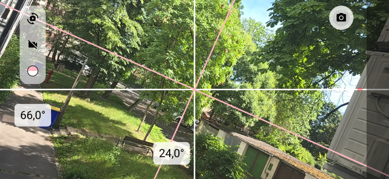

# AngleMeter

AngleMeter is an Android app for real-time angle and alignment feedback.

## Overview

The app helps you level and align the device by combining sensor-based angle visualization with an optional live camera overlay.

## Screenshot



## Repository

https://github.com/hyper-prog/anglemeter

## Features

- Fixed center cross with a sensor-driven rotating cross.
- Complementary angle display with readability-aware label orientation.
- Dual overlay color schemes.
- Optional live camera preview with front/back switching.
- Bottom tilt warning bar proportional to screen tilt.
- In-app screenshot capture saved to gallery.

## Stack

- Kotlin
- Jetpack Compose
- CameraX
- Android SDK (minSdk 29)

## Local Build

Use the root scripts:

```bat
build.bat
```

To remove generated artifacts:

```bat
clean.bat
```

## CI

Release APK builds are automated with GitHub Actions in:

- .github/workflows/release-apk.yml

## License

Apache License 2.0. See the LICENSE file for details.
